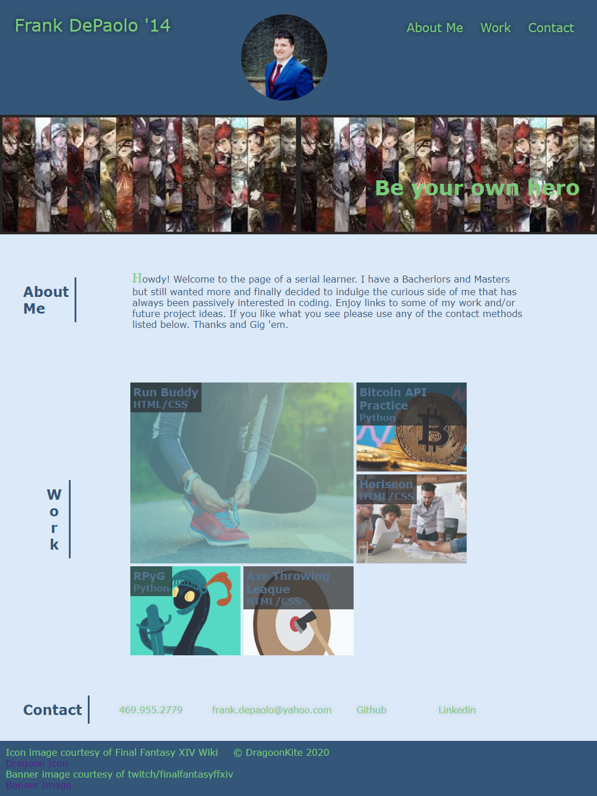

# Portfolio

## Purpose
A website designed to showcase my projects and in turn, my skills, to potential employers. 

## Built With
* Html
* CSS

## Website
https://dragoonkite.github.io/portfolio/

## Contents

One html file, an assets folder that contains an images folder and a CSS style sheet.  

## Contribution
Made with ❤️ by DragoonKite

### ©️2020 Frank DePaolo